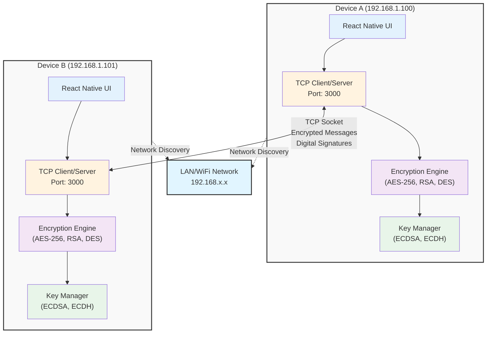
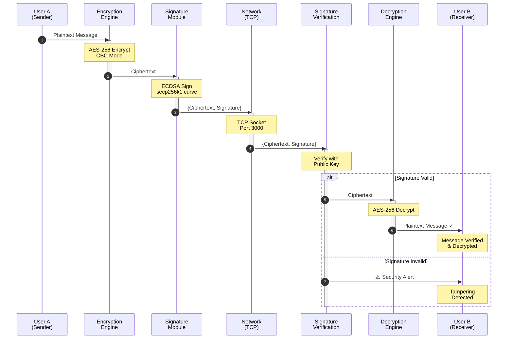
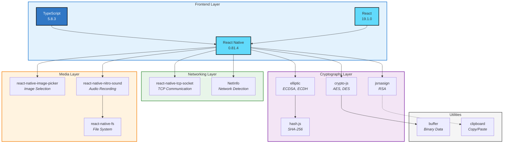

<div align="center">

# 💬 ChatNet

**Secure Peer-to-Peer Chat Application with Advanced Encryption**

[](https://reactnative.dev/)
[](https://www.typescriptlang.org/)
[](https://nodejs.org/)
[](LICENSE)

[Features](#-key-features) • [Architecture](#-architecture-overview) • [Installation](#-installation) • [Usage](#-usage) • [Security](#-security-features)

</div>

---

## 📖 Introduction

**ChatNet** is a modern, cross-platform peer-to-peer chat application built with React Native. It enables secure, real-time communication over local networks (LAN/WiFi) with enterprise-grade encryption and authentication mechanisms.

Unlike traditional chat applications that rely on centralized servers, ChatNet establishes direct TCP connections between devices, ensuring privacy, low latency, and complete control over your data.

### Why ChatNet?

- 🔒 **Privacy-First**: No servers, no data collection, no third parties
- 🚀 **Real-Time**: Direct P2P connections with minimal latency
- 🛡️ **Military-Grade Encryption**: Multiple encryption algorithms (AES-256, RSA, DES, etc.)
- 🔐 **Cryptographic Authentication**: ECDSA digital signatures prevent message tampering
- 📱 **Cross-Platform**: Works on Android and iOS
- 🎨 **Rich Media**: Send text, images, and voice messages
- 🔑 **Secure Key Exchange**: Automated Diffie-Hellman key negotiation

---

## ✨ Key Features

### 🔐 Multiple Encryption Modes

| Algorithm | Type | Key Size | Use Case |
|-----------|------|----------|----------|
| **AES-256** | Symmetric | 256-bit | Production-ready, high security |
| **RSA Hybrid** | Asymmetric + Symmetric | 2048-bit RSA + 256-bit AES | Maximum security with perfect forward secrecy |
| **Triple DES** | Symmetric | 168-bit | Legacy compatibility |
| **Playfair** | Classical | Variable | Educational purposes |
| **Caesar** | Classical | 1-25 shift | Educational purposes |

### 🛡️ Advanced Security Features

- **ECDSA Digital Signatures**: Verify message authenticity and integrity
- **ECDH Key Exchange**: Secure automated key negotiation over insecure channels
- **Perfect Forward Secrecy**: Each message uses a unique encryption key (RSA mode)
- **Anti-Tampering**: Automatic detection of modified messages

### 📱 Rich Communication

- 💬 **Text Messaging**: Encrypted real-time chat
- 🖼️ **Image Sharing**: Send photos with automatic compression
- 🎤 **Voice Messages**: Record and send audio clips
- ⏱️ **Timestamps**: Track message history
- 📊 **Delivery Status**: Real-time connection monitoring

---

## 🏗️ Architecture Overview

### System Architecture



### Message Flow (Full Security Mode)



### Technology Stack



---

## 📋 Prerequisites

### Development Environment

| Requirement | Version | Purpose |
|-------------|---------|---------|
| **Node.js** | ≥ 20.x | JavaScript runtime |
| **npm** or **yarn** | Latest | Package manager |
| **Git** | Latest | Version control |

### Android Development

| Tool | Version | Notes |
|------|---------|-------|
| **Android Studio** | Godzilla (2024)+ | IDE |
| **JDK** | 17 or 21 | Java Development Kit |
| **Android SDK** | API 35 | Build Tools 35.0.0 |
| **Gradle** | 8.10.2 | Build system |
| **Android Gradle Plugin** | 8.7.3 | Build plugin |

**Minimum Device Requirements:**
- Android 5.0+ (API 21+)
- 100MB free storage
- WiFi or LAN connectivity

### iOS Development (macOS only)

| Tool | Version | Notes |
|------|---------|-------|
| **macOS** | Ventura (13.0)+ | Operating system |
| **Xcode** | 14.0+ | IDE |
| **CocoaPods** | Latest | Dependency manager |
| **iOS Deployment Target** | 13.4+ | Minimum iOS version |

---

## 🚀 Installation

### 1. Clone the Repository

```bash
git clone https://github.com/nnkhanhduy/ChatNet.git
cd ChatNet
```

### 2. Install Dependencies

```bash
# Using npm
npm install

# Or using yarn
yarn install
```

### 3. iOS Setup (macOS only)

```bash
cd ios
pod install
cd ..
```

### 4. Android Configuration

Ensure `android/local.properties` exists with your SDK path:

```properties
sdk.dir=C:\\Users\\YourUsername\\AppData\\Local\\Android\\sdk
```

> **Note**: Replace `YourUsername` with your actual Windows username.

---

## 📱 Running the Application

### Start Metro Bundler

In your terminal, start the Metro development server:

```bash
npm start

# Or with network access for physical devices
npm run start:network
```

Keep this terminal running throughout development.

### Run on Android

Open a new terminal and execute:

```bash
# Run on connected device or emulator
npm run android

# Or using React Native CLI
npx react-native run-android
```

**Troubleshooting:**
- Enable USB Debugging on your Android device
- Check connected devices: `adb devices`
- For multiple devices: `adb -s <device_id> install app.apk`

### Run on iOS (macOS only)

```bash
# Default simulator
npm run ios

# Specific simulator
npx react-native run-ios --simulator="iPhone 15 Pro"

# Physical device (requires Apple Developer Account)
npx react-native run-ios --device
```

---

## 📦 Building for Production

### Android APK

#### Debug Build

```bash
# Using npm script
npm run build:apk

# Or manually
cd android
./gradlew assembleDebug
cd ..

# Output: android/app/build/outputs/apk/debug/app-debug.apk
```

#### Release Build (Signed)

```bash
npm run build:release

# Output: android/app/build/outputs/apk/release/app-release.apk
```

**Configure Signing** in `android/app/build.gradle`:

```gradle
signingConfigs {
    release {
        storeFile file('my-release-key.keystore')
        storePassword 'your-store-password'
        keyAlias 'my-key-alias'
        keyPassword 'your-key-password'
    }
}
```

#### Install APK on Device

```bash
# Debug APK
npm run install:apk

# Release APK
npm run install:release

# Manual installation
adb install -r path/to/app.apk
```

---

## 💡 Usage

### Initial Setup

1. **Launch the app** on both devices
2. **Ensure both devices are on the same WiFi/LAN network**
3. **Tap the ⚙️ Settings icon** in the top-right corner

### Configuration

#### Device A:
1. Note your IP address (e.g., `192.168.1.100`)
2. Enter Device B's IP in "🌐 Recipient IP"
3. Choose encryption mode (recommended: **AES** or **RSA**)
4. Set encryption key (for AES/DES) or exchange RSA keys

#### Device B:
1. Note your IP address (e.g., `192.168.1.101`)
2. Enter Device A's IP in "🌐 Recipient IP"
3. **Use the same encryption settings** as Device A

### Encryption Modes Setup

#### AES/DES Mode (Shared Key)
```
Device A: Key = "my_secret_key_123"
Device B: Key = "my_secret_key_123" (must match)
```

#### RSA Hybrid Mode (Public Key Exchange)
```
Device A:
1. Tap "Generate RSA Keys"
2. Copy your public key
3. Share with Device B (via QR code, text, etc.)
4. Paste Device B's public key in settings

Device B:
1. Tap "Generate RSA Keys"
2. Copy your public key
3. Share with Device A
4. Paste Device A's public key in settings
```

#### ECDH Key Exchange (Automated)
```
Device A:
1. Tap "Generate ECDH Keys"
2. Tap "Start Key Exchange"
3. Wait for Device B to respond

Device B:
1. Tap "Generate ECDH Keys"
2. Receive key exchange request
3. Shared key automatically configured ✓
```

### Sending Messages

- **Text**: Type in the input field and tap send ✉️
- **Images**: Tap 📷 icon and select from gallery
- **Voice**: Tap and hold 🎤 to record, release to send

### Example Scenario

```
Device A (192.168.1.100):
├─ Recipient IP: 192.168.1.101
├─ Encryption: AES
├─ Key: "secure_key_2024"
└─ Message: "Hello, World!"
    └─ Encrypted: "U2FsdGVkX1+..."
        └─ Sent via TCP

Device B (192.168.1.101):
├─ Recipient IP: 192.168.1.100
├─ Encryption: AES
├─ Key: "secure_key_2024" (matches Device A)
└─ Received: "U2FsdGVkX1+..."
    └─ Decrypted: "Hello, World!" ✓
```

---

## 🔒 Security Features

ChatNet implements multiple layers of security. For detailed cryptographic specifications, see [SECURITY.md](SECURITY.md).

### Encryption Algorithms

#### 1. AES-256 (Recommended)
- **Type**: Symmetric block cipher
- **Key Size**: 256 bits
- **Mode**: CBC with PKCS7 padding
- **Use Case**: Production environments

#### 2. RSA Hybrid Encryption
- **Type**: Asymmetric + Symmetric
- **RSA Key Size**: 2048 bits
- **AES Key Size**: 256 bits
- **Features**: Perfect forward secrecy, unlimited message length
- **Use Case**: Maximum security requirements

#### 3. Triple DES
- **Type**: Symmetric block cipher
- **Key Size**: 168 bits (3 × 56-bit keys)
- **Mode**: CBC
- **Use Case**: Legacy system compatibility

#### 4. Playfair Cipher
- **Type**: Classical digraph substitution
- **Use Case**: Educational purposes

#### 5. Caesar Cipher
- **Type**: Classical substitution
- **Shift**: 1-25 positions
- **Use Case**: Educational purposes

### Authentication & Key Exchange

#### ECDSA Digital Signatures
- **Curve**: secp256k1 (Bitcoin curve)
- **Hash**: SHA-256
- **Purpose**: Message authentication and integrity verification

#### ECDH Key Exchange
- **Curve**: secp256k1
- **Purpose**: Secure shared secret generation
- **Feature**: Automated key negotiation

### Security Best Practices

> [!IMPORTANT]
> - Always use **AES-256** or **RSA Hybrid** for production
> - Enable **Digital Signatures** to prevent message tampering
> - Use **ECDH Key Exchange** instead of manual key sharing
> - Never share private keys or encryption keys over insecure channels
> - Regularly regenerate RSA key pairs

> [!WARNING]
> Caesar and Playfair ciphers are **NOT secure** for real-world use. They are included for educational purposes only.

---

## 📁 Project Structure

```
ChatNet/
├── android/                    # Android native code
│   ├── app/
│   │   ├── build.gradle       # App-level Gradle config
│   │   └── src/               # Android source files
│   └── build.gradle           # Project-level Gradle config
│
├── ios/                        # iOS native code
│   ├── ChatNET/               # iOS app files
│   ├── ChatNET.xcodeproj/     # Xcode project
│   └── Podfile                # CocoaPods dependencies
│
├── src/                        # Application source code
│   ├── components/            # React components
│   │   ├── ChatInput.tsx      # Message input component
│   │   ├── ChatMessage.tsx    # Message display component
│   │   ├── Header.tsx         # App header
│   │   └── SettingsModal.tsx  # Settings & configuration
│   │
│   ├── hooks/                 # Custom React hooks
│   │   └── useTcpSocket.ts    # TCP socket management
│   │
│   ├── utils/                 # Utility functions
│   │   ├── aesCipher.ts       # AES-256 encryption
│   │   ├── caesarCipher.ts    # Caesar cipher
│   │   ├── desCipher.ts       # Triple DES encryption
│   │   ├── playfairCipher.ts  # Playfair cipher
│   │   ├── rsaCipher.ts       # RSA hybrid encryption
│   │   ├── security.ts        # ECDSA & ECDH implementation
│   │   ├── cryptoPolyfill.ts  # Crypto polyfills
│   │   └── responsive.ts      # Responsive scaling utilities
│   │
│   ├── types.ts               # TypeScript type definitions
│   └── constants.ts           # App constants
│
├── assets/                     # Static assets
│   └── Logo.jpg               # App logo
│
├── App.tsx                     # Root component
├── index.js                    # App entry point
├── package.json                # Dependencies & scripts
├── tsconfig.json               # TypeScript configuration
├── babel.config.js             # Babel configuration
├── metro.config.js             # Metro bundler config
├── README.md                   # This file
└── SECURITY.md                 # Security documentation
```

---

## 🤝 Contributing

We welcome contributions from the community! Here's how you can help:

### Reporting Bugs

1. Check if the issue already exists in [Issues](https://github.com/nnkhanhduy/ChatNet/issues)
2. Create a new issue with:
   - Clear title and description
   - Steps to reproduce
   - Expected vs actual behavior
   - Screenshots (if applicable)
   - Device info (OS, version, etc.)

### Suggesting Features

1. Open an issue with the `enhancement` label
2. Describe the feature and its use case
3. Explain why it would benefit users

### Pull Requests

1. Fork the repository
2. Create a feature branch: `git checkout -b feature/amazing-feature`
3. Make your changes
4. Test thoroughly on both Android and iOS
5. Commit with clear messages: `git commit -m 'Add amazing feature'`
6. Push to your fork: `git push origin feature/amazing-feature`
7. Open a Pull Request

### Development Guidelines

- Follow existing code style (TypeScript, ESLint)
- Add comments for complex logic
- Update documentation for new features
- Ensure backward compatibility
- Test on multiple devices

---

## 📄 License

This project is licensed under the **MIT License** - see the [LICENSE](LICENSE) file for details.

```
MIT License

Copyright (c) 2024 ChatNet Contributors

Permission is hereby granted, free of charge, to any person obtaining a copy
of this software and associated documentation files (the "Software"), to deal
in the Software without restriction, including without limitation the rights
to use, copy, modify, merge, publish, distribute, sublicense, and/or sell
copies of the Software, and to permit persons to whom the Software is
furnished to do so, subject to the following conditions:

The above copyright notice and this permission notice shall be included in all
copies or substantial portions of the Software.

THE SOFTWARE IS PROVIDED "AS IS", WITHOUT WARRANTY OF ANY KIND, EXPRESS OR
IMPLIED, INCLUDING BUT NOT LIMITED TO THE WARRANTIES OF MERCHANTABILITY,
FITNESS FOR A PARTICULAR PURPOSE AND NONINFRINGEMENT.
```

---

## 🙏 Acknowledgments

ChatNet is built with amazing open-source technologies:

- [React Native](https://reactnative.dev/) - Cross-platform mobile framework
- [crypto-js](https://github.com/brix/crypto-js) - Cryptographic algorithms
- [elliptic](https://github.com/indutny/elliptic) - Elliptic curve cryptography
- [jsrsasign](https://github.com/kjur/jsrsasign) - RSA cryptography
- [react-native-tcp-socket](https://github.com/Rapsssito/react-native-tcp-socket) - TCP networking

Special thanks to all contributors and the open-source community.

---

<div align="center">

**⭐ If you find ChatNet useful, please star this repository! ⭐**

[⬆ Back to Top](#-chatnet)

</div>
